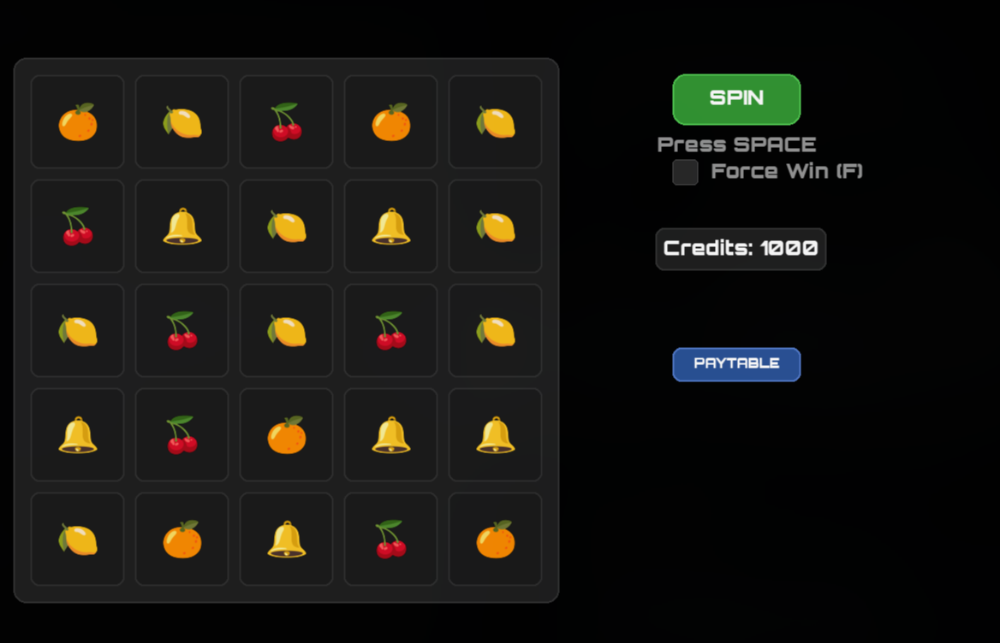

# Python Slot Machine Game

This is a simple graphical slot machine game built using Python and Pygame.



## Features

* Classic 5x5 grid slot machine.
* Spin animation and particle effects for wins.
* Win detection for horizontal, vertical, and 2x2 block patterns.
* "Force Win" option for testing.
* Interactive UI with mouse and keyboard controls.
* Sound effects for spin and win events.
* Paytable to display symbol values and win multipliers.

## Setup and Running the Game

This project uses a Python virtual environment to manage dependencies.

1.  **Prerequisites**:
    * Ensure you have Python 3 installed on your system.
    * The `python3-venv` package might be needed if not already installed (e.g., on Debian/Ubuntu: `sudo apt install python3-venv`).

2.  **Run the Setup Script**:
    Open your terminal in the project's root directory and execute the setup script:

    ```bash
    chmod +x run_game.sh
    ./run_game.sh
    ```

    This script will:
    * Create a virtual environment named `venv` (if it doesn't exist).
    * Activate the virtual environment.
    * Install the required `pygame` dependency from `requirements.txt`.
    * Launch the game.

## Controls

* **Mouse Click / SPACE Bar**: Spin the reels.
* **Mouse Click on Checkbox / F Key**: Toggle "Force Win" mode.
* **Mouse Click on PAYTABLE button / P Key**: Show/Hide the paytable.
* **ESC Key**: Quit the game.

## Project Structure

* `main.py`: Main entry point for the game.
* `game.py`: Contains the `Game` and `Particle` class logic.
* `constants.py`: Defines game constants like symbols and their properties.
* `run_game.sh`: Bash script to set up the environment and run the game.
* `requirements.txt`: Lists Python dependencies.
* `assets/`: Contains subdirectories for fonts and sounds.
  * `assets/fonts/`: Game fonts.
  * `assets/sounds/`: Game sound effects (e.g., `spin.wav`, `win.wav`). 